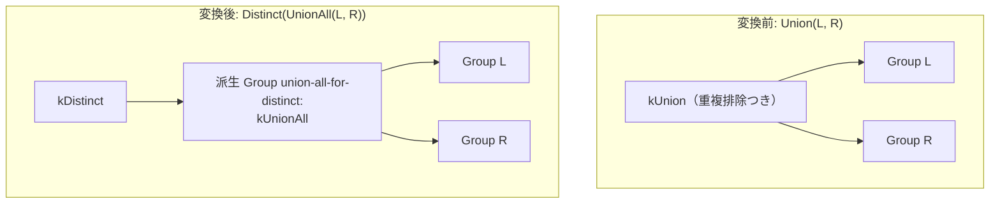

# union_to_union_all_plus_distinct

- 状態: draft / 執筆基準リビジョン: `3880673` (2026-09-12)
- 定義位置: `plan/cascades.cpp` の `RuleSet::Default()`（登録名 `"union_to_union_all_plus_distinct"`）

## 概要

`union_to_union_all_plus_distinct` は、重複排除を伴う集合演算 `Union(children)` を、素の連結演算と重複排除演算の 2 段階 `Distinct(UnionAll(children))` へと分解する Rule である。

連結処理（Append）と重複排除処理（Distinct）をパイプラインとして分離し、それぞれに対して独立した物理アルゴリズムの選択や他 Rule による最適化（平坦化、プッシュダウン等）を適用可能にする。

## 変換前後の関係



## 適用条件

パターンは `Pattern::Op(LogicalOperator::kUnion, {})` であり、対象演算子は `LogicalOperator::kUnion` である。

```cpp
    // UNION DISTINCT is equivalent to UNION ALL followed by duplicate
    // elimination. Keeping both forms in the memo lets the implementation
    // rules choose the direct set operator or the reusable append + distinct
    // pipeline independently.
    built.Add(Rule(
        "union_to_union_all_plus_distinct",
        Pattern::Op(LogicalOperator::kUnion, {}),
        [](const Bindings&, Memo& memo, GroupId group,
           const LogicalExpression& expression) {
          const GroupId union_all = memo.EnsureDerivedGroup(
              memo.Get(group).relations, "union-all-for-distinct");
          memo.AddExpression(
              union_all,
              LogicalExpression{.operation = LogicalOperator::kUnionAll,
                                .children = expression.children});
          memo.AddExpression(
              group, LogicalExpression{.operation = LogicalOperator::kDistinct,
                                       .children = {union_all}});
        },
        LogicalOperator::kUnion));
```

式が `LogicalOperator::kUnion` であれば無条件で発火する。追加の複雑なガード条件は存在しない。

## 意味論的根拠と多重度保存

SQL 規格および関係代数において、UNION（DISTINCT）は「UNION ALL の結果に対する DISTINCT 演算」と定義されており、完全な恒等関係が成り立つ。

- **代数的恒等式**: 実行器（`executor/set_operation.cpp`）における `kUnion` の処理（`AppendDistinct`）は、`kUnionAll`（`AppendAll`）の出力タプルを順次ハッシュセット等の重複排除機構に通すことと完全に一致する。
- **派生グループの隔離**: `"union-all-for-distinct"` という固有タグを付与した派生グループを生成することにより、生成された `UnionAll` 式が他の無関係なグループと不適切に混線することを防止する。
- **物理実装の直交性**: 本 Rule は重複排除の具体的アルゴリズム（Hash, Sort, Skip-Scan）を何ら規定しない。純粋な論理レベルでの演算子分解に徹することで、後続の Implementation Rule による柔軟な最適化の余地を最大化する。

## 実装の詳細

`plan/cascades.cpp` における変換処理は、2 つの `AddExpression` で完結する。

1. `memo.EnsureDerivedGroup(memo.Get(group).relations, "union-all-for-distinct")` により、同一関係集合を持つ派生グループ `union_all` を取得または作成する。
2. 派生グループ `union_all` に、元の `kUnion` と同一の子リストを持つ `kUnionAll` 式を登録する。
3. 元のグループに、派生グループ `union_all` を唯一の子とする `kDistinct` 式を登録する。

## 最適化効果

「直接の単一 UNION 演算子」と「UNION ALL + DISTINCT パイプライン」の 2 つの代替表現が Memo 内に共存する。

Append 処理をパイプラインストリーミングで行いつつ、子の順序性を活かしてソート済み重複排除を行うなど、直接のハッシュ集合演算よりも低コストな物理プランの探索が可能となる。

## 関連 Rule との相互作用

- `union_all_merge`: 派生グループ内に生成された `UnionAll` が入れ子を含む場合に平坦化を行う。
- `union_distinct_hash_sort_choice`: 同系統の分解を行う兄弟 Rule であり、派生グループタグの違い等がある。
- `values_fold_into_union`: 分岐が VALUES のみで構成される場合に単一ノードへ畳み込む。
- `push_limit_through_union_all` / `union_all_push_limit`: 分解後の `UnionAll` に対する Limit 押し込みを行う。

## 検証テスト

- `plan/cascades_test.cpp` の `CascadesTest.UnionDistinctRewriteAddsUnionAllAndDistinctAlternative`: `kUnion` 式を探索した際、同一グループ内に `kDistinct` の代替式が登録されることを検証する。
