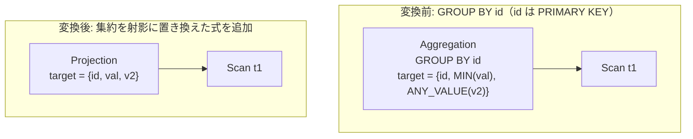

# unique_group_key_aggregate_elimination

- 状態: draft / 執筆基準リビジョン: `3880673` (2026-09-12)
- 定義位置: `plan/cascades.cpp` の `RuleSet::Default()`（登録名 `"unique_group_key_aggregate_elimination"`）

## 概要

`unique_group_key_aggregate_elimination` は、GROUP BY のグルーピングキーが入力タプルの一意キー（PRIMARY KEY または UNIQUE 制約）であると証明できる場合に、集約演算子（Aggregation）を行ごとの射影演算子（Projection）へと置き換える Rule である。

キーが一意であれば各グループには高々 1 行しか存在しないため、グループ内の `MIN(x)`, `MAX(x)`, `ANY_VALUE(x)` の評価値は常に対象行の `x` そのものと一致する。この性質を利用して集約処理そのものを消去する。

## 変換前後の関係



## 適用条件

パターンは `Aggregation(Any("input"))` であり、対象演算子は `LogicalOperator::kAggregation` である。変換ラムダ内で以下のガード条件を検証する。

```cpp
          // Uniqueness must be PROVEN by a UNIQUE/PRIMARY KEY constraint on
          // the exact qualified grouping column.  A bare-name match merges
          // t1.id with t2.id, and the old "column happens to be named id/pk"
          // heuristic fabricated uniqueness for nullable columns, dropping
          // duplicate elimination entirely (DISTINCT over a join became a
          // bare Projection).
```

発火条件および非発火条件は以下の通りである。

1. 子ノード数が 1 であり、`grouping_sets` および `target_list` が空でないこと。入力グループが自グループと一致しないこと。
2. 入力グループのスキーマから PRIMARY KEY または UNIQUE 制約を持つ列（`unique_cols`）を収集し、`grouping_sets` の**すべての**キーが列参照かつ `unique_cols` に含まれていること（完全な一意性の証明）。
3. `target_list` 内の集約関数が、DISTINCT、FILTER、HAVING を持たず、種類が `kMin`, `kMax`, `kAnyValue` のいずれかのみであること。それ以外の集約関数（`COUNT`, `SUM`, `AVG` 等）が 1 つでも含まれる場合は発火しない。
4. 集約を含まないターゲット（キー列等）はそのまま射影ターゲットとして維持される。

## 意味論的根拠と多重度保存

集約の削除は、タプル多重度の一致が数学的に証明される場合にのみ許容される。

- **一意性証明の厳密性**: GROUP BY キーが一意でない場合、入力行数が複数であっても集約によって 1 行に縮約される。この状況で集約を射影に置き換えると、同一キーを持つ複数行がすべて出力されてしまい、タプル多重度が破壊される（過去の「id/pk という名前の列なら一意とみなす」ヒューリスティクスが引き起こしたバグの反省に基づく）。修飾子を含めた完全なカタログ制約による証明が必須である。
- **1 行グループにおける集約等価性**: 濃度 1 の集合 $\{v\}$ に対し、$\min(\{v\}) = \max(\{v\}) = \text{any\_value}(\{v\}) = v$ が厳密に成立する。したがって、集約計算を単なる列の参照へと縮退させても値は一切変化しない。
- **対象関数の限定理由**: `COUNT(v)` は $v$ が NULL でない場合 1、NULL の場合 0 となり、型の相違や NULL 検査が必要となる。また `SUM(v)` も同様の型プロモーションを伴う。本 Rule は型変換の不整合を防ぐため、値が完全に一致する 3 種類に限定して適用する。
- **修飾子の排除**: `FILTER` 句や `HAVING` 句を伴う集約は、1 行グループであっても行の除外が発生し得るため、無条件の射影置換を禁止する。

## 実装の詳細

`plan/cascades.cpp` における変換処理は、ターゲットリストの走査と置換によって行われる。

```cpp
              if (agg.GetType() == AggregationType::kMin ||
                  agg.GetType() == AggregationType::kMax ||
                  agg.GetType() == AggregationType::kAnyValue) {
                proj_targets.emplace_back(target.name, agg.Child());
              } else {
                return;
              }
```

置換完了後、入力グループを直接の子とする `LogicalOperator::kProjection` 式を構築し、ルートグループへ登録する。

```cpp
          memo.AddExpression(
              group,
              LogicalExpression{.operation = LogicalOperator::kProjection,
                                .children = {input_id},
                                .target_list = std::move(proj_targets),
                                .output_schema = expression.output_schema});
```

元の集約式も Memo 内に残るため、万一コスト評価で集約が有利と判定された場合でも安全である。

## 最適化効果

ハッシュテーブル構築、バッファリング、ソートなどを伴う高コストな集約オペレータが完全に消去される。

行ごとの単純な射影評価のみに縮退するため、CPU サイクルおよび作業メモリの消費量が大幅に削減される。

## 関連 Rule との相互作用

- `group_by_functional_dependency_reduction`: 関数従属性に基づいて不要な GROUP BY キーを削減し、残ったキーによる一意性証明を助ける。
- `pk_unique_distinct_elimination`: 一意キーに対する DISTINCT を射影へ縮退させる類似の Rule。
- `any_value_elimination`: 式レベルで冗長な `ANY_VALUE` を簡約する。

## 検証テスト

- `plan/cascades_test.cpp` の `CascadesTest.UniqueGroupKeyAggregateElimination`: 主キー `t1.id` で GROUP BY を行う集約式（`MIN(val)`, `ANY_VALUE(v2)` を含む）から、3 つの列参照を持つ `Projection` 式が生成されることを検証する。
