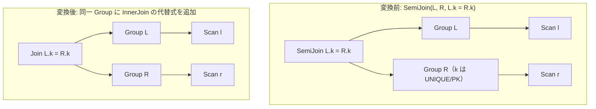

# unique_semi_to_inner

- 状態: draft / 執筆基準リビジョン: `3880673` (2026-09-12)
- 定義位置: `plan/cascades.cpp` の `RuleSet::Default()`（登録名 `"unique_semi_to_inner"`）

## 概要

`unique_semi_to_inner` は、`SemiJoin(L, R, p)` において、右側の結合キーが一意（UNIQUE または PRIMARY KEY）であると証明できる場合に、半結合を通常の内部結合 `InnerJoin(L, R, p)` へと置き換える論理等価 Rule である。

右側のキーが一意であれば、任意の左側タプルに対してマッチする右側タプルは高々 1 件となる。したがって内部結合を行っても左側タプルが増殖することはなく、半結合と全く同一のタプル多重度を保ったまま、より豊富な結合アルゴリズム（Hash Join, Index Join 等）の探索空間を開放する。

## 変換前後の関係



## 適用条件

パターンは `SemiJoin(Any("left"), Any("right"))` であり、対象演算子は `LogicalOperator::kSemiJoin` である。変換ラムダ内で以下のガード条件を検証する。

```cpp
    // unique_semi_to_inner: Convert SemiJoin(L, R, p) to InnerJoin(L, R, p)
    // when right side keys are unique (each left row then has at most one
    // match, so inner and semi keep the same multiplicity).  Uniqueness is
    // proven from the catalog-published schema: the predicate must be
    // exactly the key equality and the right-side column must carry a
    // UNIQUE/PRIMARY KEY constraint.
```

発火条件および非発火条件は以下の通りである。

1. 式が `LogicalOperator::kSemiJoin` であり、子ノード数が 2 であること。
2. 結合述語が存在し、ヘルパー `SingleUniqueKeyEquality(memo, p, r_left, r_right, r_right)` を満たすこと。
3. `SingleUniqueKeyEquality` の要求:
   - 述語を連言に分解した際、要素数が**厳密に 1 つ**であること。
   - 述語が単純な列対列の等値比較（`L.k = R.k`）であること。
   - カタログ公開スキーマ（`memo.GetTableSchemas()`）を参照し、右側テーブルの当該列が PRIMARY KEY または UNIQUE 制約を持つこと。

述語に追加のフィルタ条件が含まれる場合や、右キーの一意性が証明できない場合は発火しない。

## 意味論的根拠と多重度保存

半結合から内部結合への変換における正当性の根拠は、右側タプルのマッチ多重度にある。

- **多重度の一致保証**: 半結合は条件を満たす左側タプルを「高々 1 回」出力する。一方、内部結合はマッチした右側タプルの数だけ左側タプルを複製する。もし右側テーブルにおいて結合キーの値 $k$ を持つタプルが複数存在する場合、内部結合は左側タプルを増殖させてしまい、クエリ結果の行数が変わる。右側キーが一意であることがカタログ制約によって保証されている場合に限り、マッチ数は常に 0 または 1 となり、内部結合と半結合の多重集合（Multiset）は完全に一致する。
- **追加連言の排除理由**: `SingleUniqueKeyEquality` が単一の等値比較に限定しているのは、ヘルパーを共有する他の結合削除系 Rule との整合性および安全側の配慮による。
- **カタログ制約の必須性**: 列名が偶然 `id` や `pk` であるといったヒューリスティクスは排除され、DDL 定義に基づく制約情報のみを信頼する。

## 実装の詳細

`plan/cascades.cpp` における変換処理は以下の通りである。

```cpp
          if (expression.predicate) {
            std::string r_left = left_group.relations.empty()
                                     ? ""
                                     : left_group.relations.front();
            std::string r_right = right_group.relations.empty()
                                      ? ""
                                      : right_group.relations.front();
            if (SingleUniqueKeyEquality(memo, *expression.predicate, r_left,
                                        r_right, r_right)) {
              memo.AddExpression(
                  group,
                  LogicalExpression{.operation = LogicalOperator::kJoin,
                                    .children = {left_id, right_id},
                                    .predicate = expression.predicate,
                                    .target_list = expression.target_list,
                                    .output_schema = expression.output_schema});
            }
          }
```

条件を満たした場合、元の `target_list` と `output_schema` を引き継いだ `LogicalOperator::kJoin` 式をルートグループへ登録する。

## 最適化効果

半結合専用の物理オペレータ（SemiHashJoin など）に限定されていたプラン候補が、汎用の Inner Join オペレータ（Hash Join, Merge Join, Index Nested Loop Join 等）および結合順序探索へと一気に拡張される。

インデックスを利用した高速なプローブや、より効率的な駆動表の選択が可能となる。

## 関連 Rule との相互作用

- `semijoin_to_inner_plus_distinct`: 右キーの一意性が証明できない場合に、DISTINCT を付加して内部結合化を行う補完 Rule である。一意性が証明できる場合は本 Rule の方が DISTINCT のコストがないため優位となる。
- `semi_join_commutativity` / `semi_join_inner_join_reorder`: 半結合のまま順序を入れ替える代替 Rule 群である。

## 検証テスト

- `plan/cascades_test.cpp` の `CascadesTest.UniqueSemiToInnerRewrite`: 右表の主キーを用いた半結合から、`kJoin` 代替式が生成されることを検証する。
- `plan/cascades_test.cpp` の `CascadesTest.UniqueSemiToInnerDoesNotFireWithoutKeyEquality`: 述語が不等号比較などの場合に発火しない安全性を検証する。
