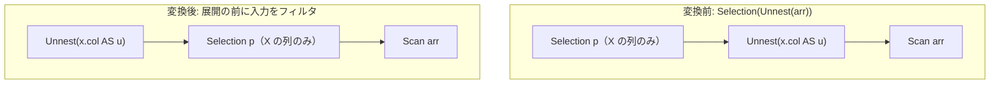

# unnest_filter_pushdown

- 状態: draft / 執筆基準リビジョン: `3880673` (2026-09-12)
- 定義位置: `plan/cascades.cpp` の `RuleSet::Default()`（登録名 `"unnest_filter_pushdown"`）

## 概要

`unnest_filter_pushdown` は、`Selection(Unnest(X), p)` において、述語 `p` が UNNEST 操作によって生成された列（展開値および順序位置）を参照していない場合に、フィルタを UNNEST の入力側へ押し込んで `Unnest(Selection(X, p))` へと書き換える Rule である。

配列等のコレクションを展開する「前」に入力タプルをフィルタリングすることで、無駄な要素展開処理の発生そのものを未然に防ぎ、実行時コストを抑制する。

## 変換前後の関係



## 適用条件

パターンは `Selection(Unnest(Any(), "unnest"))` であり、対象演算子は `LogicalOperator::kSelection` である。変換ラムダ内で以下のガード条件を検証する。

```cpp
              bool touches_unnest = false;
              for (const auto& col : touched) {
                if ((!unnest.unnest_alias.empty() &&
                     IdentifierEquals(col.name, unnest.unnest_alias)) ||
                    (!unnest.offset_alias.empty() &&
                     IdentifierEquals(col.name, unnest.offset_alias))) {
                  touches_unnest = true;
                  break;
                }
              }
              if (touches_unnest) {
                continue;
              }
```

発火条件および非発火条件は以下の通りである。

1. 選択述語が存在すること。
2. `unnest` グループが現在のグループ自身でないこと。
3. `unnest` グループ内に、子ノード数 1 の `LogicalOperator::kUnnest` 式が存在すること。
4. 述語が参照するすべての列名が、UNNEST の展開値別名（`unnest_alias`）および位置序数列別名（`offset_alias`）のいずれとも一致しないこと（大文字小文字を無視して照合）。
5. 新規派生グループ（`"sel_unnest_child"`）が入力グループまたは現在のグループと一致しないこと。

述語が UNNEST の生成列を参照している場合は発火しない。

## 意味論的根拠と多重度保存

UNNEST 演算子をまたぐ述語プッシュダウンの健全性は、属性の依存関係とタプルの生存条件の一致に基づいている。

- **生成列の未定義性**: `unnest_alias` や `offset_alias` は UNNEST による配列展開の結果として初めて生成される属性である。展開前の入力タプルにおいてこれらの属性は存在しないため、物理的・代数的に下位へ押し込むことは不可能である。
- **入力行と展開行の真偽値の一致**: UNNEST は 1 つの入力行から 0 個以上の展開行を生成するが、生成されたすべての行は親となる入力行の属性値をそのまま引き継ぐ。したがって、入力属性のみに依存する述語 $p(X)$ の真偽値は、同一の入力行から生成されるすべての展開行において常に一定（すべて真、またはすべて偽）である。したがって、展開前に入力行を除外することと、展開後に生成された全行を除外することは結果として完全に等価である。
- **多重度への影響**: 不合格な入力行を先行除外しても、合格した入力行の展開多重度（配列の要素数）には何ら影響を与えないため、多重集合の意味論は完全に維持される。

## 実装の詳細

`plan/cascades.cpp` における変換処理は以下の通りである。

```cpp
            const GroupId unnest_child = unnest.children[0];
            const GroupId sel_below = memo.EnsureDerivedGroup(
                memo.Get(unnest_child).relations, "sel_unnest_child");
            if (sel_below != unnest_child && sel_below != group) {
              memo.AddExpression(
                  sel_below, LogicalExpression{
                                 .operation = LogicalOperator::kSelection,
                                 .children = {unnest_child},
                                 .predicate = expression.predicate,
                                 .output_schema =
                                     memo.Get(unnest_child).expressions.empty()
                                         ? Schema()
                                         : memo.Get(unnest_child)
                                               .expressions.front()
                                               .output_schema});
              LogicalExpression new_unnest = unnest;
              new_unnest.children = {sel_below};
              memo.AddExpression(group, std::move(new_unnest));
            }
            return;
```

1. UNNEST の入力グループに対して派生グループ `sel_below` を作成し、元の述語を持つ `kSelection` 式を登録する。
2. ルートグループに対して、子を `sel_below` に付け替えた新しい `kUnnest` 式を登録する。

## 最適化効果

UNNEST は要素数に応じてタプル数を増殖させる展開演算子であるため、展開前に入力行を削減する効果は極めて大きい。

除外されたタプルに対する無駄なメモリ確保、要素反復、および後続オペレータへの行転送がすべて回避される。

## 関連 Rule との相互作用

- `push_selection_through_projection`: 射影に対する述語プッシュダウンと同様の階層移動。
- `push_selection_into_scan`: 押し込まれた Selection がさらにスキャンフィルタへと統合される契機を作る。

## 検証テスト

- `plan/cascades_test.cpp` の `CascadesTest.UnnestFilterPushdown`: `unnest_alias = "elem"` を持つ Unnest ノード上のフィルタ `t1.id > 10` が、Unnest の下位の Selection として正常に押し込まれることを検証する。
