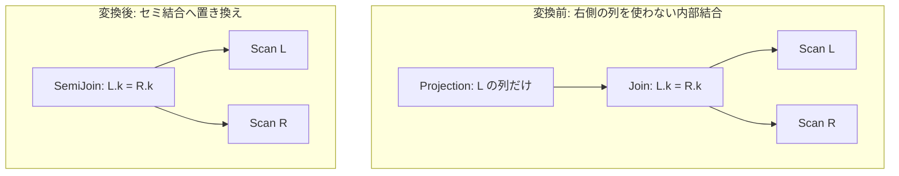

# unused_join_elimination

- 状態: draft / 執筆基準リビジョン: `3880673` (2026-09-12)
- 定義位置: `plan/cascades.cpp` の `RuleSet::Default()`（登録名 `"unused_join_elimination"`）

## 概要

`unused_join_elimination` は、`Projection(Join(L, R))` において、上位の射影が右側リレーション $R$ の列を一切参照しておらず、かつ結合条件のキーが一意である場合に、内部結合をセミ結合 `SemiJoin(L, R)` へと置き換える Rule である。

結合結果において右側の列が不要であっても、内部結合はマッチ行数に応じて左側タプルを複製する。右側キーの一意性が保証されている場合に限り、タプル多重度を変えることなくセミ結合へ変換し、不要なタプル増殖を抑制する。

## 変換前後の関係



## 適用条件

パターンは `Projection(Any("input"))` であり、対象演算子は動的に探索される。変換ラムダ内で以下のガード条件を検証する。

```cpp
    // unused_join_elimination: Rewrite an inner join whose right side is
    // never projected into a SEMI join.  PRODUCTION FIX: the previous form
    // replaced the join with a bare left-side projection.  An inner join
    // duplicates left rows when the right side matches more than once, so
    // the rewrite silently changed the result cardinality, and it also
    // dropped left-side-only predicate conjuncts.  A semi join preserves
    // the filtering property but is still NOT multiplicity-preserving
    // unless every right-side equality key is UNIQUE: the semi conversion
    // therefore requires that uniqueness proof (COUNT(*) over
    // p1 JOIN p2 ON p1.k = p2.k used to report 7 instead of 11).
```

発火条件および非発火条件は以下の通りである。

1. 射影の `target_list` が空でなく、参照するすべての列が結合の左側リレーションにのみ属すること（ヘルパー `ProjectionUsesOnlyLeftSide`）。
2. 射影内に集約式が含まれていないこと（`!ContainsAggregate`）。
3. 入力グループ内に、子ノード数 2 かつ結合述語を持つ `LogicalOperator::kJoin` 式が存在すること（クロス結合相当の述語なし結合は除外）。
4. 結合述語に含まれる相関連言（左右両方にまたがる項）について、右側結合キーが PRIMARY KEY または UNIQUE 制約を持つことがカタログスキーマ上で証明されていること（ヘルパー `RightSideJoinKeysAreUnique`）。

## 意味論的根拠と多重度保存

かつて「右側列が不要なら結合を完全に消去して左側射影にする」という誤った最適化が存在したが、これはタプル多重度を無視した危険な変換であった。本 Rule は厳格な多重度保存の規律に従う。

- **行複製とセミ結合のフィルタ特性**: 内部結合は、右側に複数の一致行が存在する場合に左側行を複製する。右側の列を出力しないクエリであっても、全体の行数（カーディナリティ）は変化する。セミ結合は「右側に 1 つでも一致行が存在する左側行を残す」ため、フィルタ特性は保存されるが、多重度（重複カウント）は最大 1 に制限される。
- **一意性証明の必須性**: 右側キーが一意であれば、任意の左側行に対する右側の一致件数は 0 または 1 に限定される。この場合に限り、内部結合の出力行数とセミ結合の出力行数は完全に一致する（かつて `COUNT(*)` が 11 であるべきところを 7 と誤計算したバグを是正する門番条件である）。
- **集約の禁止**: 射影に集約関数（`COUNT(*)` 等）が含まれる場合、結合結果の多重度が集約値に直接影響するため、本変換は適用できない。
- **局所述語の保持**: 片側のみに依存する述語連言が存在する場合でも、生成されるセミ結合は述語全体をそのまま引き継ぐため、フィルタリング条件の脱落は発生しない。

## 実装の詳細

`plan/cascades.cpp` における変換処理は以下の通りである。

```cpp
            LogicalExpression semi = expression;
            semi.children = {join.children[0], join.children[1]};
            semi.operation = LogicalOperator::kSemiJoin;
            semi.predicate = join.predicate;
            memo.AddExpression(group, std::move(semi));
```

右側一意性の証明が成功した場合、元の内部結合式と同じ子リストおよび述語を保持した `LogicalOperator::kSemiJoin` 式をルートグループへ登録する。

## 最適化効果

右側に一致する行が多数存在するような 1 対多リレーションにおいて、内部結合による無駄な中間タプルの複製およびバッファリングが完全に排除される。

セミ結合はプローブ側で 1 件一致した時点で即座に次のタプルへ進むことができるため（Early Out）、プローブ処理の CPU 負荷が大幅に軽減される。

## 関連 Rule との相互作用

- `unique_semi_to_inner`: 逆向きの変換を行う Rule であり、コスト評価において競合・協調する。
- `fk_join_elimination`: 外部キー制約を用いて、結合そのものを完全に除去する関連 Rule。
- `semijoin_to_inner_plus_distinct`: セミ結合を内部結合＋DISTINCT へと展開する選択肢を提供する。

## 検証テスト

- `plan/cascades_test.cpp` の `CascadesTest.UnusedJoinEliminationRewritesToSemiJoin`: 右側が一意な内部結合に対し、セミ結合への書き換え式が生成されることを検証する。
- `plan/cascades_test.cpp` の `CascadesTest.UnusedJoinEliminationDoesNotFireWithoutPredicate`: 結合述語が存在しない（クロス積）場合に発火しない安全性を検証する。
