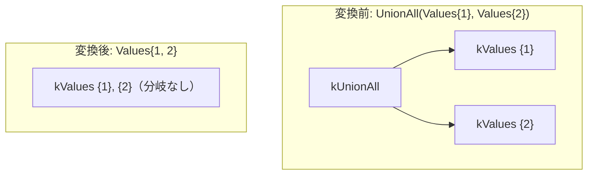

# values_fold_into_union

- 状態: draft / 執筆基準リビジョン: `3880673` (2026-09-12)
- 定義位置: `plan/cascades.cpp` の `RuleSet::Default()`（登録名 `"values_fold_into_union"`）

## 概要

`values_fold_into_union` は、すべての入力分岐が「単一行の VALUES」で構成されている `UnionAll` 演算子を、各分岐のタプルを行リストとして連結した単一の `Values` ノードへと畳み込む Rule である。

実行時における集合演算オペレータの反復実行および子エグゼキュータの起動オーバーヘッドを完全に消去し、メモリ上の静的なリテラル行リストへと縮退させる。

## 変換前後の関係



## 適用条件

パターンは `UnionAll()` であり、対象演算子は `LogicalOperator::kUnionAll` である。変換ラムダ内で以下のガード条件を検証する。

```cpp
    // values_fold_into_union: UnionAll over single-row Values branches -> a
    // single Values node concatenating every branch row. UNION ALL is bag
    // concatenation, and equal-width branches share the set operation's
    // positional column contract, so the fold preserves the multiset -- but
    // a real UNION ALL also coerces every branch to the set-op result type,
    // while ValuesExecutor emits rows verbatim. Every branch column type
    // must therefore match the first branch's declared type, or the folded
    // node would claim INT64 while carrying a DOUBLE value
    // (`SELECT 1 UNION ALL SELECT 2.5`). Only single-row branches fold:
    // collapsing multi-row branches would destroy the merge/parallelism
    // alternatives (MergeAppend over individually ordered branches) that
    // costing otherwise exploits.
```

発火条件および非発火条件は以下の通りである。

1. 式が `LogicalOperator::kUnionAll` であり、子ノード数が 2 以上であること。
2. **すべての**子グループが、少なくとも 1 つの `LogicalOperator::kValues` 式を保持していること。
3. 各分岐の出力列数（スキーマ幅）が、先頭分岐の列数と完全に一致すること。
4. 各分岐が**厳密に 1 行**の VALUES であること（`branch.values.size() == 1`）。複数行を持つ分岐が含まれる場合は発火しない。
5. 各分岐のすべての列の型が、先頭分岐の対応する列の型と完全に一致すること（型プロモーションが必要な分岐は除外）。

## 意味論的根拠と例外保護・型安全性

単一行 VALUES の畳み込みにおける正当性は、多重集合の一致と物理エグゼキュータの型契約に基づいている。

- **多重集合の同一性**: UNION ALL は各分岐の出力タプルを単純に結合した bag を生成する。単一行 VALUES を集約して 1 つの VALUES ノードに順次配置した結果は、多重集合として完全に同一である。
- **型プロモーションの回避と安全性**: 通常の UNION ALL 演算子は、異なる型を持つ分岐（例: `SELECT 1 UNION ALL SELECT 2.5`）に対して、共通の上位型（DOUBLE）への暗黙的な型変換（coercion）を実行時に行う。しかし、`ValuesExecutor` は保持しているリテラル値をそのまま出力する設計である。もし型が一致しない分岐を無差別に畳み込むと、スキーマ宣言は INT64 であるにもかかわらず DOUBLE の実値を搬送するという深刻な型不整合が発生する。したがって、列の型が完全に一致していることの証明を必須条件とする。
- **最適化機会の保護（単一行制限）**: 複数行を持つ VALUES 分岐を畳み込んでしまうと、個々の分岐が持つソート順序や並行実行（MergeAppend パイプライン等）を活用する物理プランの選択肢を奪ってしまう。そのため、畳み込みによる損失が生じない「単一行」の分岐のみを対象とする。

## 実装の詳細

`plan/cascades.cpp` における変換処理は以下の通りである。

```cpp
          LogicalExpression merged = expression;
          merged.operation = LogicalOperator::kValues;
          merged.children = {};
          merged.values = std::move(folded);
          merged.output_schema = std::move(folded_schema);
          memo.AddExpression(group, std::move(merged));
```

1. 各子グループから最初の `kValues` 式を抽出し、その行データを集約用ベクトル `folded` に追加する。
2. 1 つでも型や行数の条件を満たさない分岐があれば即座にリターンする。
3. 先頭分岐の `output_schema` を引き継ぎ、子ノードを持たない純粋な葉ノードとしての `LogicalOperator::kValues` 式をルートグループへ登録する。

## 最適化効果

実行時において集合演算オペレータそのものが完全に消滅する。

多数の定数リテラルタプルを生成するクエリにおいて、イテレータのネスト構造が解消され、メモリ効率と実行速度が大幅に向上する。

## 関連 Rule との相互作用

- `union_all_merge`: 多段にネストした UNION ALL を平坦化し、本 Rule が「全分岐が単一行 VALUES」であることを検知しやすくする。
- `union_to_union_all_plus_distinct`: `UNION DISTINCT` を `UnionAll + Distinct` に展開し、本 Rule による VALUES 化の前提を作る。

## 検証テスト

- `plan/cascades_test.cpp` の `CascadesTest.ValuesFoldIntoUnionAll`: 同一スキーマの単一行 VALUES を 2 分岐に持つ `kUnionAll` を探索した際、要素数 2 のタプルリストを持つ単一の `kValues` 代替式が生成されることを検証する。
