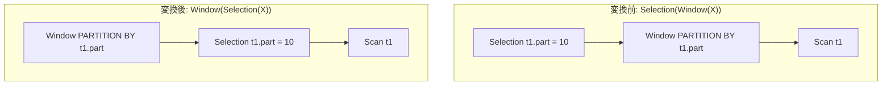

# window_after_filter_partition_pushdown

- 状態: draft / 執筆基準リビジョン: `3880673` (2026-09-12)
- 定義位置: `plan/cascades.cpp` の `RuleSet::Default()`（登録名 `"window_after_filter_partition_pushdown"`）

## 概要

`window_after_filter_partition_pushdown` は、`Selection(Window(X))` において、フィルタが参照しているすべての列が Window 演算子の PARTITION BY 式に現れる列のみで構成されている場合に、フィルタ全体を Window 演算子の下位へと押し込む Rule である。

ウィンドウ関数の計算は各パーティション内部の行集合に閉じて実行されるため、パーティションキーに対する述語を事前に適用して無関係なパーティション全体を除外しても、残るパーティション内の計算結果は一切変化しない。これにより Window 演算子の入力タプル数を最小化する。

## 変換前後の関係

`WHERE t1.part = 10`（PARTITION BY `t1.part`）の例:



## 適用条件

パターンは `Selection(Any("input"))` であり、対象演算子は `LogicalOperator::kSelection` である。変換ラムダ内で以下のガード条件を検証する。

```cpp
    // window_after_filter_partition_pushdown: When a Filter above Window
    // references only partition keys of the Window, push the filter below the
    // Window operator.
```

発火条件および非発火条件は以下の通りである。

1. 選択述語が存在し、入力グループ内に子ノード数 1 かつ非空の `partition_by` を持つ `LogicalOperator::kWindow` 式が存在すること。
2. Window の子ノードが現在のグループ自身または入力グループと一致しないこと。
3. PARTITION BY リスト内の各式の `TouchedColumns()` から収集されたパーティション参照列集合に対し、述語が参照する**すべての**列が含まれていること（部分一致やパーティション外列の参照がある場合は発火しない）。
4. 派生グループ（`filter_below_window:<predicate>`）が循環を形成しないこと。

兄弟 Rule である `push_selection_through_window` と異なり、部分プッシュダウンは行わず、述語の全連言がパーティションキーに閉じている場合のみ全体を一括で押し込む。

## 意味論的根拠と多重度保存

ウィンドウ関数の意味論におけるパーティション独立性が本 Rule の論拠である。

- **パーティション間の直交性**: ウィンドウ関数の評価（`ROW_NUMBER()`, `RANK()`, `SUM() OVER (...)` 等）は、同一パーティションキーを持つタプル集合の内部でのみ実行される。あるパーティションのタプルが除外されても、異なるパーティションに属するタプルの集約値やランク値には何の影響も及ぼさない。
- **全パーティション単位の除外**: 述語がパーティションキーのみに依存する場合、特定のパーティションに属する全タプルは「すべて真（全員残る）」か「すべて偽（全員除外される）」のどちらかになる。したがって、Window の評価前に対象外パーティションを除外しても、残存するパーティション内のタプル多重度やウィンドウ計算結果は完全に一致する。
- **ウィンドウ出力列参照の排除**: `ROW_NUMBER()` などのウィンドウ関数結果列に対するフィルタは、パーティションキーではないため本 Rule では押し込まれない。

## 実装の詳細

`plan/cascades.cpp` における変換処理は以下の通りである。

```cpp
            if (filtered_child != win_child && filtered_child != group) {
              memo.AddExpression(
                  filtered_child,
                  LogicalExpression{.operation = LogicalOperator::kSelection,
                                    .children = {win_child},
                                    .predicate = expression.predicate,
                                    .output_schema = win_expr.output_schema});

              LogicalExpression new_win = win_expr;
              new_win.children = {filtered_child};
              memo.AddExpression(group, std::move(new_win));
            }
```

1. 派生グループ `filtered_child` を生成し、Window の入力ノード（`win_child`）の上に元の述語を持つ `kSelection` 式を登録する。
2. ルートグループに対して、入力を `filtered_child` に差し替えた `LogicalOperator::kWindow` 式を登録する。

## 最適化効果

パーティション列に対する選択率が高いクエリにおいて、Window 演算子が処理すべきタプル数が劇的に減少する。

下位へ押し込まれた Selection はさらに `push_selection_into_scan` などによってスキャンフィルタへ統合され、インデックス走査やゾーンマップ剪定と連携してストレージ I/O を削減する。

## 関連 Rule との相互作用

- `push_selection_through_window`: 連言の一部のみがパーティションキーに依存する場合に部分押し込みと残差の再適用を行う兄弟 Rule である。
- `rank_row_number_to_topn`: ウィンドウ関数の結果列（`rn <= 10` 等）に対するフィルタを TopN へ変換する。
- `split_window`: 混在した Window 仕様を分割し、個別のパーティションキーに対する本 Rule の発火を促す。

## 検証テスト

- `plan/cascades_test.cpp` の `CascadesTest.WindowAfterFilterPartitionPushdown`: `PARTITION BY t1.part` を持つ Window 上のフィルタ `t1.part = 10` が、Window の下位の Selection として正常に押し込まれることを検証する。
