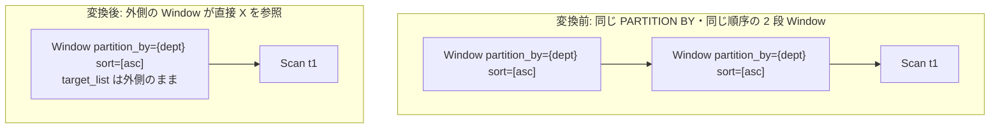

# window_frame_sort_sharing

- 状態: draft / 執筆基準リビジョン: `3880673` (2026-09-12)
- 定義位置: `plan/cascades.cpp` の `RuleSet::Default()`（登録名 `"window_frame_sort_sharing"`）

## 概要

`window_frame_sort_sharing` は、入れ子になった 2 段の `Window(Window(X))` において、両ノードの PARTITION BY およびソート順序が互換である場合に、内側の Window ノードをバイパスして外側の Window を入力 $X$ へ直接接続する代替式を登録する Rule である。

同一または包含関係にあるパーティション仕様および順序付け処理の重複を排除し、多重のソートやパーティションバッファリングを単一の実行経路へと統合する。

## 変換前後の関係



## 適用条件

パターンは `Pattern::Op(kWindow, {Pattern::Op(kWindow, {}, "inner")})` であり、対象演算子は `LogicalOperator::kWindow` である。変換ラムダ内で以下のガード条件を検証する。

```cpp
    // window_frame_sort_sharing: Combine and share prefix sorts across multiple
    // compatible window specifications.
```

発火条件および非発火条件は以下の通りである。

1. 外側 Window の `target_list` が空でないこと。内側グループが現在のグループ自身でないこと。
2. 内側グループ内に子ノード数 1 の `LogicalOperator::kWindow` 式が存在し、その子が自グループまたは内側グループと一致しないこと。
3. 外側と内側の `partition_by` リストが完全に一致すること（`inner.partition_by == outer.partition_by`）。
4. ソート順序指定が完全に一致しているか、あるいは外側の Window がソート順序を要求していない（空である）こと。
5. 外側の `target_list` が、内側 Window の出力列（内側で新たに生成されたウィンドウ関数結果）を参照していないこと。

## 意味論的根拠と物理実行の契約

同一の入力行集合に対する同一パーティション分割および順序付けは、演算子の実行順序を統合してもその結果が不変となる。

- **パーティション・ソート順序の互換性**: Window 演算は入力をパーティションごとにまとめ、指定された順序でソートした上で関数を評価する。同一の PARTITION BY かつ同一（または空）の ORDER BY を持つ 2 つの Window 演算子は、タプルに対して全く同一のクラスタリングおよび順序付けを適用する。
- **孤立出力列（orphan output）の防止**: 本 Rule が生成する直結代替式は、外側の `target_list` のみを保持し、内側の `target_list` をマージしない。したがって、もし外側の式が内側の Window が算出した出力列を参照している場合、その属性が未解決となってプランが破壊される。そのため、外側が内側出力に依存していないことをガード条件で厳密に確認する。
- **物理実行契約**: パーティションソートが 1 回に集約されることで、物理化層において不要な再ソートオペレータの挿入（Enforcer）が抑制される。

## 実装の詳細

`plan/cascades.cpp` における変換処理は以下の通りである。

```cpp
              LogicalExpression combined = outer;
              combined.children = inner.children;
              memo.AddExpression(group, std::move(combined));
```

1. 外側の `LogicalExpression` を複製する。
2. 子ノードリスト `children` を内側 Window の子ノード（`inner.children`）に差し替える。
3. ルートグループに対して、直結された `LogicalOperator::kWindow` 式を追加する。

## 最適化効果

ウィンドウ関数実行における最も重い処理であるパーティション分割およびタプルソートの反復が排除される。

中間の一時バッファリングが不要となり、単一の走査パスの中で外側 Window の計算を完了できる。

## 関連 Rule との相互作用

- `merge_adjacent_windows`: 出力ターゲットリストを融合して完全な 1 つのノードへ合体させる姉妹 Rule。
- `split_window`: 混在した Window を分割し、本 Rule による順序共有の機会を提供する。
- `sort_merge_of_compatible_orders`: ソート演算子同士の互換順序統合を担う Rule。

## 検証テスト

- `plan/cascades_test.cpp` の `CascadesTest.WindowFrameSortSharing`: 同一の `PARTITION BY t1.dept` および同一昇順ソートを持つ 2 段の Window 式から、スキャンノードに直結された 1 段の Window 代替式が生成されることを検証する。
